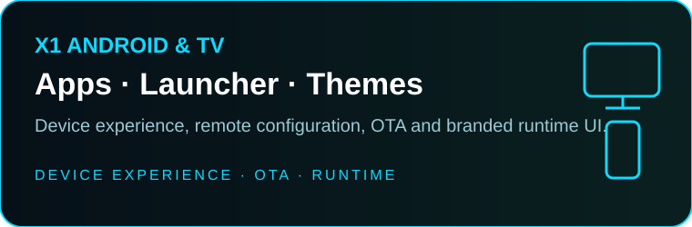
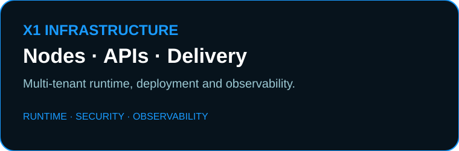
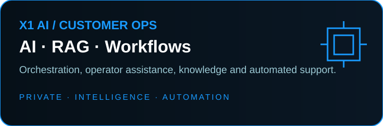
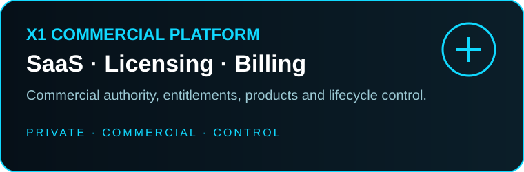

  

  
  
  
  
  

  <strong>SOFTWARE · IPTV TECHNOLOGY · ANDROID / TV · AUTOMATION · INTELLIGENT OPERATIONS</strong>

---

## X1 // SOFTWARE THAT OPERATES

**X1 is a software and technology ecosystem.** We build practical public software, commercial products and private operational systems under one identity.

Our focus is straightforward: **useful software, clear operational control and engineering that solves real problems.**

> ### PUBLIC SOFTWARE SHOULD BE USEFUL AS RELEASED.
> We do not publish intentionally crippled projects just to sell the missing functionality back later.

Public projects, commercial products and private engineering each have a clear boundary. They share the X1 identity, but they are not one giant application split into paid unlocks.

---

## WHAT X1 BUILDS

<table>
<tr>
<td width="50%" valign="top">

 <strong>Android / TV Systems</strong> 
Application control, device workflows, compatibility tooling and operational interfaces for TV environments.
</td>
<td width="50%" valign="top">

 <strong>IPTV & Infrastructure</strong> 
Management systems, data pipelines, EPG, picons, routing, deployment tooling and operational infrastructure.
</td>
</tr>
<tr>
<td width="50%" valign="top">

 <strong>Automation & Intelligent Operations</strong> 
Operational automation, observability, incident handling and controlled remediation designed around outcomes.
</td>
<td width="50%" valign="top">

 <strong>Commercial X1 Platform</strong> 
Private products and services built for serious operational environments, with proprietary engineering kept protected.
</td>
</tr>
</table>

---

  

## PUBLIC SYSTEMS

| Project | Purpose |
|---|---|
| **[X1 Stream Manager Community](https://github.com/x1-dotcom/X1-Stream-Manager-Community)** | Community stream-management tooling and operational workflows. |
| **[X1 Panel XCIPTV](https://github.com/x1-dotcom/X1-Panel-XCIPTV)** | X1 control tooling for compatible XCIPTV application workflows. |
| **[X1 TiviMate Community](https://github.com/x1-dotcom/x1tivimate)** | Public management tooling for TiviMate-related workflows. |
| **[X1 Smarters V5](https://github.com/x1-dotcom/Smarters-V5)** | Android / TV application tooling and X1 control workflows. |
| **[X1 EPG](https://github.com/x1-dotcom/x1epg)** | EPG catalogue, validation, ingestion and publication tooling. |
| **[X1 Picons](https://github.com/x1-dotcom/picons)** | Multi-country picon catalogue and supporting tooling. |
| **[X1 WAVEO](https://github.com/x1-dotcom/WAVEO)** | Production-oriented WAVEO control plane with device operations, sync, activation, security and compatibility tooling. |

### Support that leads to fixes

If something behaves differently in your environment, **open an Issue in the relevant repository** with the app version, Android/device details, affected flow, reproduction steps and sanitized logs.

**We investigate reproducible problems and work on corrections.** Compatibility issues are treated as engineering work to measure, reproduce and resolve — not something to hide behind vague claims.

---

  

## X1 IPTV PLATFORM

X1 develops its own **IPTV management platform as a dedicated X1 system**.

It is separate from the public application-control projects above and is designed for **serious operational control, automation and day-to-day management of IPTV environments**.

The parts that create commercial and operational value remain private: production topology, proprietary automation, security boundaries, privileged workflows and business-critical implementation details.

---

  

## AURA // INTELLIGENT OPERATIONS

**AURA is X1's intelligent operations layer.** Its goal is not merely to answer tickets, but to help turn operational signals into controlled outcomes.

For supported workflows, AURA is designed to understand context, detect incidents, coordinate safe actions, verify results and communicate what happened. Sensitive operations remain governed by permissions, policy and approval controls.

> **The best support interaction is sometimes the one where the supported problem is already resolved before it becomes a ticket.**

---

## PUBLIC FACE // PRIVATE ENGINEERING

Public documentation explains what X1 systems do and how to use the parts we intentionally publish.

Private engineering remains protected: credentials, signing material, production topology, customer environments, anti-abuse controls, proprietary automation, privileged procedures, unreleased R&D and other business-critical implementation details.

**Transparency about capability does not require publishing the blueprint of the private platform.**

---

## X1 // ENGINEERING PRINCIPLES

`FUNCTIONAL > FREEMIUM THEATRE`  
`SECURITY > CONVENIENCE SHORTCUTS`  
`CLEAR RESPONSIBILITY > DUPLICATED AUTHORITY`  
`AUTOMATION + CONTROL`  
`FAST OPERATIONAL UX`  
`MEASURE → REPRODUCE → FIX`  
`AUDITABILITY`  
`PUBLIC COMMUNITY WORK + PRIVATE COMMERCIAL ENGINEERING`

---

## COMMUNITY // SUPPORT // DEVELOPMENT

  
  
  

  Found a reproducible problem? Report it in the relevant repository. 
  <strong>We review it, reproduce it and work on the fix.</strong>

---

  <strong>PUBLIC SOFTWARE. PRIVATE ENGINEERING. ONE X1 IDENTITY.</strong>  
  © 2026 X1Tech Solutions SA. All Rights Reserved.

