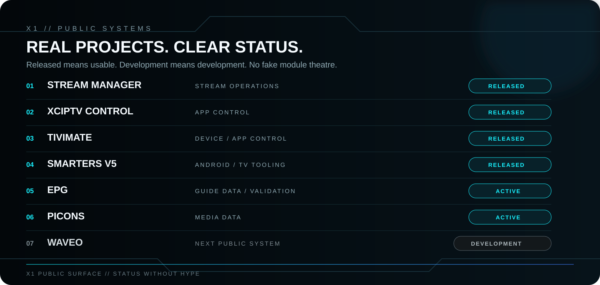
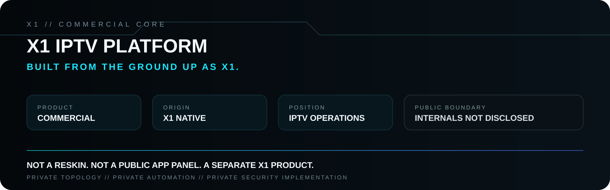
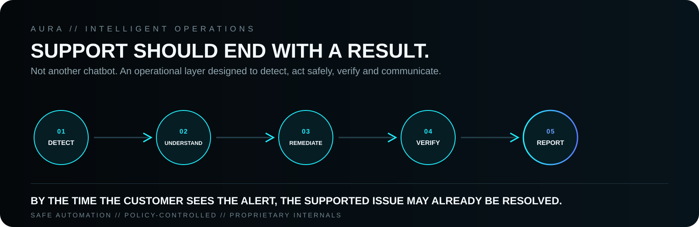
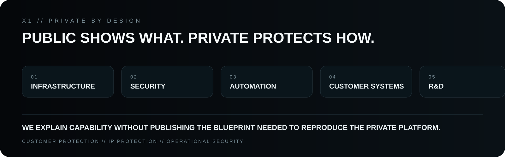

  

  
  
  
  

  <strong>PUBLIC SOFTWARE · IPTV TECHNOLOGY · ANDROID / TV · AUTOMATION · INTELLIGENT OPERATIONS</strong>

---

## X1 // NOT ONE PANEL

**X1 is a software and technology ecosystem.** We build independent public projects, commercial products and private operational technology under one identity.

What appears here is intentionally the **public surface of X1**. It is not a map of everything that exists internally.

> ## FREE MEANS FUNCTIONAL.
> If X1 publishes software publicly, it is intended to be useful as released — not deliberately crippled so that the useful part can be sold back later.

Commercial X1 products are separate products. Private engineering remains private.

---

  

### Open the public systems

**01 — [X1 Stream Manager Community](https://github.com/x1-dotcom/X1-Stream-Manager-Community)**  
Stream-management tooling for the community.

**02 — [X1 Panel XCIPTV](https://github.com/x1-dotcom/X1-Panel-XCIPTV)**  
Public X1 control tooling for compatible application workflows.

**03 — [X1 TiviMate Community](https://github.com/x1-dotcom/x1tivimate)**  
Public management tooling for TiviMate-related workflows.

**04 — [X1 Smarters V5](https://github.com/x1-dotcom/Smarters-V5)**  
Public Android / TV application tooling.

**05 — [X1 EPG](https://github.com/x1-dotcom/x1epg)**  
EPG catalogue, validation and ingestion tooling with provenance and publication controls.

**06 — [X1 Picons](https://github.com/x1-dotcom/picons)**  
Multi-country picon catalogue and tooling.

**07 — [WAVEO](https://github.com/x1-dotcom/WAVEO)**  
Public repository reserved for a next X1 public system. **Development status — not presented as a released product yet.**

> These are independent projects. They are **not paid modules of one giant application**.

---

  

## X1 IPTV PLATFORM

X1 develops its own **IPTV management platform, built from the ground up as an X1 system**.

It is a separate commercial product from the public application-control projects above. It is not presented as a re-skin, a public app panel or a collection of paid unlocks.

Its public position is simple: **serious operational control for IPTV environments**.

The implementation that gives the platform its commercial value stays private: internal topology, proprietary automation, security boundaries, private operational methods and other business-critical engineering.

---

  

## AURA

**AURA is X1's intelligent support and operations layer.**

The objective is not to build another bot that waits for a ticket and returns text. AURA is designed around operational outcomes: understand context, detect supported incidents, coordinate safe remediation, verify the result and communicate what happened.

For supported low-risk actions, remediation can be automated. Sensitive operations remain governed by policy, permissions and approval controls.

> **By the time the customer sees the alert, the supported issue may already be resolved.**

AURA is evolving with the next generation of X1. Its internal orchestration, security controls, decision logic and remediation methods are proprietary.

---

## X1 SAAS

The commercial ecosystem is supported by a private X1 SaaS platform.

Publicly, its role is to coordinate the customer-facing commercial side of X1 products and services, including licensing and product delivery.

The internal data model, business rules, integrations, contracts, automation and security implementation are private X1 technology.

---

  

## THE PUBLIC BOUNDARY

We deliberately do not publish the blueprint of the private platform.

Production topology, privileged procedures, credentials, signing material, private service contracts, proprietary automation/remediation logic, anti-abuse controls, customer environments, unreleased R&D and other business-critical implementation details remain private.

**Public documentation explains capability. It does not disclose the implementation required to reproduce the commercial platform.**

---

## X1 // ENGINEERING CODE

`FUNCTIONAL > FREEMIUM THEATRE`  
`SECURITY > CONVENIENCE SHORTCUTS`  
`CLEAR RESPONSIBILITY > DUPLICATED AUTHORITY`  
`AUTOMATION + CONTROL`  
`FAST OPERATIONAL UX`  
`AUDITABILITY`  
`PUBLIC COMMUNITY WORK + PRIVATE COMMERCIAL ENGINEERING`

---

## COMMUNITY // X1

  
  
  

---

  <strong>FREE MEANS FUNCTIONAL.</strong> 
  <strong>PRIVATE MEANS PROTECTED.</strong>  
  <strong>ONE X1 IDENTITY.</strong>

  © 2026 X1Tech Solutions SA. All Rights Reserved.

