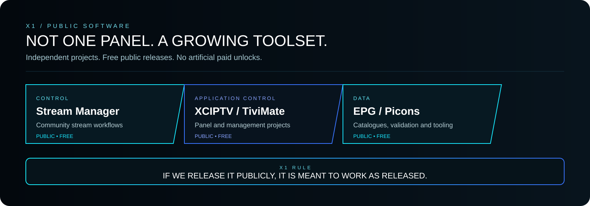
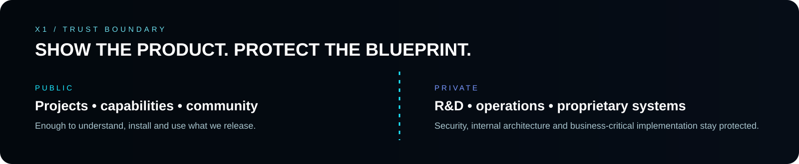

  

  
  
  
  

  <strong>PUBLIC SOFTWARE · IPTV TECHNOLOGY · ANDROID / TV · AUTOMATION · INTELLIGENT OPERATIONS</strong>

---

## X1 is not one panel

**X1 is a software and technology ecosystem.** We build independent public projects, commercial platforms and private operational technology under one identity.

What appears on this GitHub profile is intentionally the **public surface of X1**, not a diagram of everything that exists internally.

> ### Free means functional.
> When X1 publishes software publicly, it is intended to be useful as released — not deliberately crippled so that the real features can be sold back later.

Commercial X1 products are separate products. Private engineering remains private.

  

---

## Public software

| Project | Purpose |
|---|---|
| **[X1 Stream Manager Community](https://github.com/x1-dotcom/X1-Stream-Manager-Community)** | Community stream-management tooling. |
| **[X1 Panel XCIPTV](https://github.com/x1-dotcom/X1-Panel-XCIPTV)** | Public X1 control-panel project for compatible application workflows. |
| **[X1 TiviMate Community](https://github.com/x1-dotcom/x1tivimate)** | Public management tooling for TiviMate-related workflows. |
| **[X1 Smarters V5](https://github.com/x1-dotcom/Smarters-V5)** | Public project in the Android / TV application tooling family. |
| **[X1 Picons](https://github.com/x1-dotcom/picons)** | Multi-country picon catalogue and tooling. |
| **[X1 EPG](https://github.com/x1-dotcom/x1epg)** | EPG catalogue, validation and ingestion tooling with provenance and publication controls. |

These are independent projects. They are **not paid modules of one giant application**.

---

## X1 IPTV Platform

X1 also develops its own **IPTV management platform, built from the ground up as an X1 system**.

It is not a re-skinned application-control panel and it is not the same product as the public projects above. Its public role is straightforward: serious operational control for IPTV environments.

We deliberately do **not** publish its internal topology, proprietary automation, security boundaries or business-critical implementation details.

---

## AURA

**AURA is X1's intelligent support and operations layer.**

It is designed to do more than answer a support message: understand operational context, detect supported incidents, coordinate safe remediation and communicate the result.

The experience we are building toward is simple:

> **By the time the customer sees the alert, the supported problem may already be resolved.**

AURA is evolving with the next generation of X1. Its internal orchestration, security controls, remediation logic and operating methods are proprietary.

---

## X1 SaaS

The commercial ecosystem is supported by a private X1 SaaS platform.

Publicly, its role can be described as coordinating customer-facing commercial services, licensing and product delivery. The internal data model, integrations, contracts, automation and security implementation are not published.

---

  

## What stays private

To protect customers, platform security and X1 intellectual property, we do not publish production topology, privileged operational procedures, credentials or signing material, private service contracts, proprietary automation/remediation logic, internal anti-abuse controls, customer environments, unreleased R&D or other business-critical implementation details.

**Public documentation explains what X1 does. It is not a blueprint for reproducing the private platform.**

---

## X1 engineering principles

**FUNCTIONAL OVER FREEMIUM THEATRE** · **SECURITY BY DESIGN** · **CLEAR SYSTEM RESPONSIBILITY** · **AUTOMATION WITH CONTROL** · **FAST OPERATIONAL UX** · **AUDITABILITY**

---

## Community

  
  
  

---

  <strong>FREE MEANS FUNCTIONAL.</strong> 
  <strong>PRIVATE MEANS PROTECTED.</strong>  
  <strong>ONE X1 IDENTITY.</strong>

  © 2026 X1Tech Solutions SA. All Rights Reserved.

