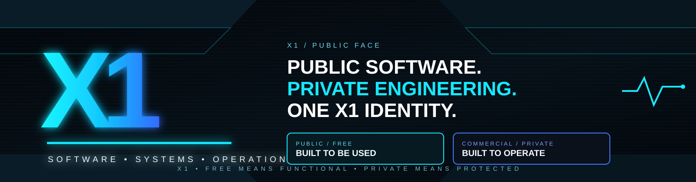
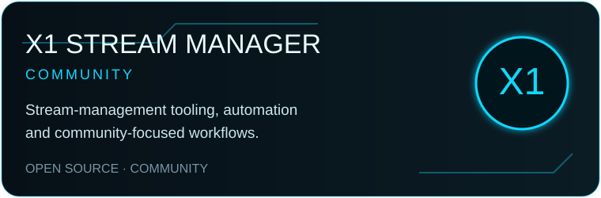
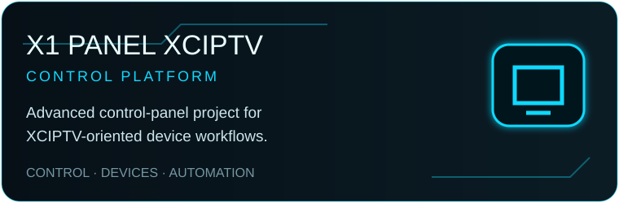
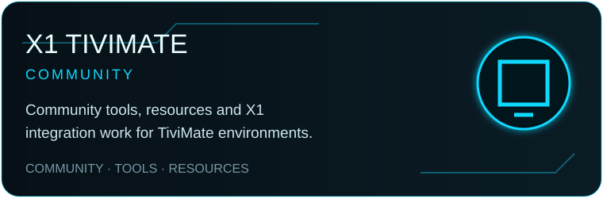
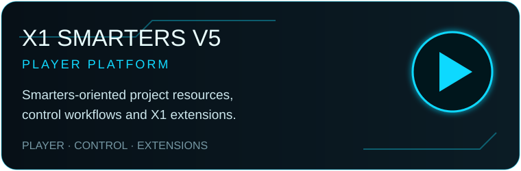
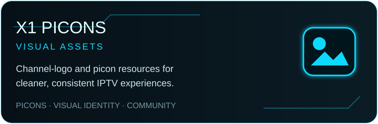

<p align="center">
  
</p>

<h1 align="center">X1</h1>

<p align="center">
  <strong>BUILD. CONTROL. AUTOMATE. SCALE.</strong><br>
  IPTV · Android · AI · Automation · Infrastructure
</p>

<p align="center">
  <a href="https://x1panel.space"></a>
  <a href="https://forum.x1panel.space"></a>
  <a href="https://discord.gg/vSSw6jHmw"></a>
  <a href="https://t.me/+XkuQS_QuD6g4Nzc0"></a>
</p>

<p align="center">
  
  
  
  
</p>

---

## ⚡ Welcome to X1

**X1** is a technology ecosystem focused on building powerful control platforms, Android experiences, automation systems and infrastructure tooling.

We design for **performance, control, security and scale** — from community projects to commercial-grade platforms.

> **One ecosystem. One identity. X1.**

---

## 🚀 Featured X1 Projects

<p align="center">
  <a href="https://github.com/x1-dotcom/X1-Stream-Manager-Community"></a>
  <a href="https://github.com/x1-dotcom/X1-Panel-XCIPTV"></a>
</p>

<p align="center">
  <a href="https://github.com/x1-dotcom/x1tivimate"></a>
  <a href="https://github.com/x1-dotcom/Smarters-V5"></a>
</p>

<p align="center">
  <a href="https://github.com/x1-dotcom/picons"></a>
</p>

<p align="center">
  <a href="https://github.com/x1-dotcom/X1-Stream-Manager-Community"></a>
  <a href="https://github.com/x1-dotcom/X1-Panel-XCIPTV"></a>
  <a href="https://github.com/x1-dotcom/x1tivimate"></a>
</p>

---

## 🧠 X1 Engineering DNA

```text
X1 ECOSYSTEM
├── CONTROL
│   ├── SaaS
│   ├── Control Panels
│   ├── Device Management
│   └── Licensing
├── EXPERIENCE
│   ├── Android / TV
│   ├── Launchers
│   ├── Themes
│   └── Remote Configuration
├── AUTOMATION
│   ├── AI Operations
│   ├── Provisioning
│   ├── OTA
│   └── Monitoring
└── INFRASTRUCTURE
    ├── APIs
    ├── Multi-tenant Services
    ├── Security
    └── Deployment
```

<p align="center">
  <strong>CONTROL PLANE</strong> · <strong>DEVICE EXPERIENCE</strong> · <strong>AUTOMATION</strong> · <strong>SECURITY</strong> · <strong>OBSERVABILITY</strong>
</p>

---

## 🛠 Technology Stack

<p align="center">
  
  
  
  
  
</p>

<p align="center">
  
  
  
  
  
</p>

---

## 🔐 Engineering Principles

| Principle | X1 Standard |
|---|---|
| 🛡️ **Secure by design** | Explicit trust boundaries, signed artifacts and fail-closed behavior. |
| ⚡ **Performance first** | Fast startup, efficient runtime and minimal unnecessary overhead. |
| 🤖 **Automation everywhere** | Provisioning, OTA, validation and operational workflows. |
| 🎯 **One authority per concern** | No duplicated control planes or ambiguous state. |
| 🌍 **Community + commercial** | Public projects coexist with hardened commercial products. |

---

## 🌐 X1 Community Network

<p align="center">
  <a href="https://forum.x1panel.space"></a>
  <a href="https://discord.gg/vSSw6jHmw"></a>
  <a href="https://t.me/+XkuQS_QuD6g4Nzc0"></a>
</p>

---

## 💠 X1 Mission

<p align="center">
  Build tools that are <strong>fast</strong>, <strong>controllable</strong>, <strong>secure</strong> and <strong>scalable</strong>.<br>
  Connect the entire X1 ecosystem under one technical and visual identity.
</p>

<p align="center">
  <strong>ONE ECOSYSTEM · ONE IDENTITY · X1</strong>
</p>

---

<p align="center">
  <strong>X1</strong><br>
  Next Generation Digital Platform
</p>

<p align="center">
  © 2026 X1Tech Solutions SA. All Rights Reserved.
</p>
